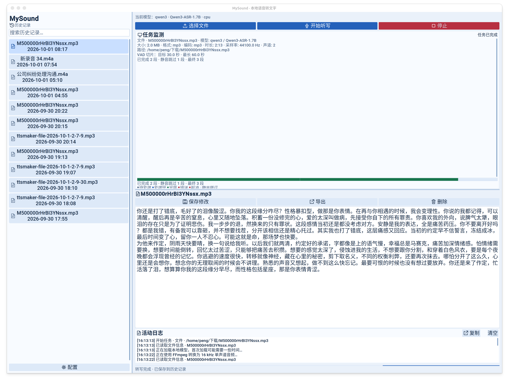
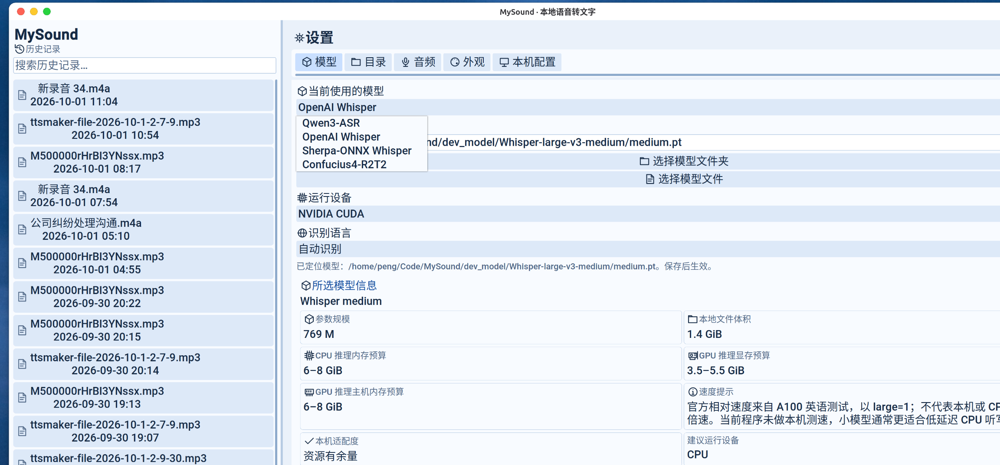

# MySound · Ubuntu 本地语音转文字

Python / CustomTkinter 桌面应用：拖入音频或视频转写、麦克风增量听写、本地模型切换、历史搜索与编辑、TXT / Markdown / SRT 导出。支持配置页面、完整明暗主题、可调字号与分栏、本机硬件检测及模型资源建议。模型推理与文件处理在后台线程运行，界面通过事件队列更新。







## 安装与启动

建议使用 **Python 3.12**。Python 3.10+ 可运行源码，但机器学习依赖在最新 Python 上的兼容性取决于上游 wheel。Ubuntu 系统包：

```bash
sudo apt update
sudo apt install python3-venv python3-tk ffmpeg portaudio19-dev libsndfile1 fonts-noto-cjk

python3 -m venv .venv
source .venv/bin/activate
python -m pip install --upgrade pip
python -m pip install -r requirements.txt

python main.py --check
python main.py
```

如果用非系统 Python（例如 Python 3.12），创建虚拟环境时使用对应解释器，并确保该解释器带有 `tkinter`。仅安装默认版本的 `python3-tk` 不会为其他 Python 版本补齐 Tk。

`requirements.txt` 包含 PyTorch 与 Sherpa-ONNX 等模型后端，首次安装体积较大。GPU 用户可先根据 [PyTorch 官方安装说明](https://pytorch.org/get-started/locally/) 安装匹配显卡驱动的 `torch` / `torchaudio`，再安装其余依赖。CPU 也支持，但大模型听写通常无法保持实时速度。`python main.py --check` 会额外尝试导入 Sherpa-ONNX，检查其原生动态库能否加载。

### 第一次使用

1. 点击左侧“配置”，在“模型”页将“扫描根目录”设为本地模型所在位置。本项目已有模型文件时，可选择 `dev_model/`。
2. 点击“扫描本地模型”，再点击列表中要使用的模型；扫描本身不会改变当前选择。也可直接选择完整模型文件夹、其中的配置或权重文件，Whisper `.pt` 文件，或 Sherpa-ONNX 的 `.onnx` 文件。压缩包需要先解压，下载未完成的 `.incomplete` 文件不能使用。
3. 选择设备 `auto` / `cpu` / `cuda`、识别语言，点击“保存”，再“返回”。Sherpa-ONNX Whisper 当前仅使用 CPU，选择该类型时设备默认设为 CPU。
4. 拖入一个音频/视频文件，或点击“开始听写”。首次任务会加载模型；相同模型的后续任务复用已加载实例。
5. 任务完成或手动停止后，已识别文本自动保存。点击历史记录可编辑，使用“保存修改”保存，或“导出”选择格式。

快捷键：`Ctrl+O` 打开文件，`Ctrl+S` 保存文本修改（配置页面内保存当前标签页），`Ctrl+E` 导出。麦克风默认使用系统输入设备，可在“配置 → 音频”中刷新设备列表后更换。

## 配置页面与窗口布局

“配置”在主窗口内打开，可随时返回转写。五个页面按用途组织；前四页分别保存设置，“本机配置”只读：

| 标签页   | 设置内容                                                              | 生效时间                                   |
| -------- | --------------------------------------------------------------------- | ------------------------------------------ |
| 模型     | 模型类型、每种模型的本地路径、扫描根目录、运行设备、识别语言          | 保存后的下一次转写                         |
| 目录     | 默认工作目录、下次启动使用的数据目录                                  | 工作目录保存后立即生效；数据目录重启后生效 |
| 音频     | 麦克风设备、听写刷新间隔、文件目标与最长切片时长                      | 保存后的下一次转写                         |
| 外观     | 深色 / 浅色、完整主题预设、中文 / 英文界面、12–48 字号、恢复默认布局 | 保存后立即生效并记住选择                   |
| 本机配置 | CPU、内存、显卡、当前可用资源、推荐模型与运行设备                     | 打开后检测，可手动刷新，无需保存           |

“外观”提供 **深海蓝、森林绿、鸢尾紫、暖沙橙** 四套完整预设，各支持深色和浅色，共 **8 种外观组合**。预设同时协调背景、面板、边框、输入框、选中状态与按钮，并提供色板预览。程序绘制的线性图标随主题和字号更新，无需额外图标字体。旧版本的蓝 / 绿 / 紫 / 橙选择会沿用对应预设。

可选择简体中文或 English，并设置 **12、14、16、18、20、22、24、28、32、36、40、48** 共 12 档基础字号；正文、控件与标题按层级同步调整，下次启动保留选择。大字号或较窄窗口下，工具栏会收起按钮文字、保留图标；将鼠标停留在图标上可查看操作名称。长说明与配置内容可滚动查看。界面语言与模型的“识别语言”独立，不会翻译已有转写内容或改变音频识别语言。

各模型分别记住自己的路径，切换模型类型时可恢复该类型上次保存的位置。

拖动历史侧栏与主区域之间的竖向分隔条，可调整左右宽度；拖动转写页采集区与文本编辑区之间的横向分隔条，可调整上下高度。窗口大小、最大化状态及两处分栏比例会自动保存，下次启动恢复。“外观”页的“恢复默认布局”可重置窗口和分栏尺寸。

转写页的“任务监测”区域会显示当前文件的格式、时长、路径、大小、采样率和声道，并用时间轴标出每个 VAD 切片的状态（待处理、处理中、完成、静音跳过或错误）。下方“活动日志”按本地时间记录任务开始、媒体读取、切片进度、麦克风连接、当前动作和错误；日志可复制或清空。时间轴保留原始媒体时长，尚未处理的尾部不会被误显示为已完成。

转写期间仍可进入配置页、调整外观和布局、刷新本机配置；模型、目录及音频设置暂不能保存，停止任务或等待完成后即可保存。

## 本机配置与模型资源建议

在“配置 → 本机配置”中查看处理器、逻辑线程、系统内存、显卡及显存信息。检测会同时读取**当前可用**内存与显存，推荐模型和 CPU / CUDA 运行路线；点击“刷新检测”可在关闭其他占用资源的程序后重新评估。硬件读取在后台运行，不会加载模型或申请模型所需的 GPU 内存；缺少的读数显示为未知。

“模型”页的资源卡随所选路径更新，展示参数规模、本地文件占用、CPU 推理主存预算、GPU 推理显存预算、**GPU 加载与暂存所需的主存预算**、速度说明和资料来源。GPU 显存充足时，加载模型仍可能需要较多系统内存，因此会同时比较两种资源。资源建议按当前可用容量与预算区间判断“建议使用”“资源较紧”“资源不足”或“需要确认”；总容量仅用于展示。

预算是当前单任务推理方式下的规划估算，尚非逐型号本机实测，也不保证模型一定加载成功或达到实时速度。音频长度、精度、依赖版本和其他进程都会改变实际峰值；本地文件体积也不能直接等同于运行内存。官方参考数据、估算假设与推荐规则见[模型资源说明与来源](docs/model-resources.md)。

## 本地模型格式

| 类型                  | 本地路径内容                                                               | 加载方式                                                          |
| --------------------- | -------------------------------------------------------------------------- | ----------------------------------------------------------------- |
| OpenAI Whisper        | 完整`.pt` 文件；或只有一个 `.pt` 的目录                                | `openai-whisper.load_model(本地文件)`                           |
| Whisper Hugging Face  | `config.json`、processor/tokenizer、完整权重                             | Transformers Whisper pipeline                                     |
| Sherpa-ONNX Whisper   | 匹配的 encoder / decoder`.onnx` 与 tokens 文件；可直接选择某个 `.onnx` | `sherpa_onnx.OfflineRecognizer.from_whisper`，CPU 后端          |
| Qwen3-ASR 0.6B / 1.7B | 原版 Qwen3-ASR 对应规格的完整模型目录                                      | 官方`qwen_asr.Qwen3ASRModel.from_pretrained`，Transformers 后端 |
| Confucius4-R2T2       | 完整 Confucius 模型目录                                                    | 与官方 R2T2 离线接口相同的 Qwen3 Transformers 后端                |

Qwen3 / Confucius 通常需要 `config.json`、`preprocessor_config.json`、tokenizer 文件和 `model.safetensors`，或所有分片及其索引文件。请导入完整仓库内容，而非只复制权重。此版使用 `qwen-asr==0.0.6` 配套的原版 Qwen checkpoint；不要混用其他 Transformers 版本专用的 `-hf` 重打包模型。

选择 Qwen3 / Confucius 的 `config.json`、权重文件或分片索引时，程序会归一到所属模型文件夹，再检查完整文件是否齐备；选择的父目录只包含一个可用的同类型模型时，也会自动定位。缺少必要文件或出现多个候选模型时会给出明确提示，需补齐下载或选择具体模型目录。

**Sherpa-ONNX Whisper 与 OpenAI Whisper 是两个独立类型，分别记忆路径。** 例如选择 `dev_model/sherpa-onnx-whisper-medium/` 时，完整 INT8 encoder / decoder 配对优先，用于节省内存；没有完整 INT8 配对时使用完整 FP32 配对，不混用精度。选择 `medium-encoder.onnx` 或 `medium-decoder.onnx` 可明确使用 FP32，选择对应 `.int8.onnx` 文件则使用 INT8；同精度的另一半权重及 `medium-tokens.txt` 仍需位于同一目录。直接选文件的路径会原样保存，以保留精度选择。INT8 占用通常较小，但识别结果可能与 FP32 不同。

此版 Sherpa-ONNX 使用 CPU 执行，`auto` 也选择 CPU；显式选择 `cuda` 会提示当前后端不支持。它不会通过 PyTorch 加载 ONNX 权重，也不需要为此模型安装 CUDA 版 Sherpa-ONNX。选择 Qwen3-ASR 时，具体 0.6B / 1.7B 规格由本地模型内容判断。

当前 `dev_model` 各目录的选择方法、Qwen 0.6B 配套文件补齐记录及实际 CPU 转写结果见[本地模型验证记录](docs/local-model-validation.md)。

PyTorch 后端设备设为 `auto` 时优先使用可用的 NVIDIA GPU。模型加载或转写发生 CUDA 显存不足时，会释放当前 GPU 模型并改用 CPU，当前音频重试一次，后续片段继续使用 CPU；状态栏会显示回退原因。CPU 推理可能明显变慢。显式选择 `cuda` 时不会自动回退，而是提示选择 `auto`、`cpu` 或更小的模型。

这里对原方案做了一个必要的接口修正：原版 Qwen3 不使用通用 `AutoModelForSpeechSeq2Seq`；官方 SDK 负责注册模型架构并进行语音处理。Confucius 的官方 `R2T2ASRModel` 继承这一离线转写实现，所以无需安装 vLLM，也无需假设本地权重附带 `trust_remote_code` 推理代码。

参考：[Qwen3-ASR 官方代码](https://github.com/QwenLM/Qwen3-ASR)、[Qwen 本地加载实现](https://github.com/QwenLM/Qwen3-ASR/blob/main/qwen_asr/inference/qwen3_asr.py)、[Confucius 官方离线/流式实现](https://github.com/netease-youdao/Confucius4-R2T2/blob/master/r2t2/r2t2_asr.py)。

运行时强制启用 Hugging Face 离线模式；缺失模型文件会明确报错，不自动下载。Silero-VAD 使用 Python 安装包自带的模型资源，无需首次联网下载。安装依赖和事先下载模型仍需要网络。

## 音频与字幕行为

- **文件转写**：FFmpeg 将媒体解码到临时 16 kHz 单声道 WAV；以最多 60 秒的窗口读取，使用 Silero-VAD 在停顿处选择边界。默认目标 30 秒，连续长句无停顿时按最长时长切开。纯静音窗口跳过，原始时间轴保留。WAV 存在磁盘上，长文件需要相应临时磁盘空间，结束或取消时自动清理。
- **增量听写**：20 ms 音频采集、有界队列、约 250 ms 环形预录缓冲。约每 2 秒重新识别当前短句并替换顶部的临时文字；约 0.7 秒静音或短句达到 15 秒时确认并追加正文。首版麦克风使用 RMS 能量检测静音，文件切片使用 Silero-VAD。停止后处理完队列与最后一个短句，再写入历史记录。
- **麦克风采样率**：设备不支持 16 kHz 时，程序会按设备默认采样率、48 kHz、44.1 kHz 依次协商，并在完整短句送入 ASR 前重采样到 16 kHz；设备名称、实际采集率和识别率会显示在任务监测中。只有所有候选采样率都被拒绝时才停止并报告设备错误。
- **实时性**：这是按短句重复解码的准实时模式，并非 Whisper/Qwen 的原生 token 流。Confucius 官方特有的稳定前缀流式接口需要另一套 vLLM 后端，此版未引入。模型处理慢于采集、队列满时会停止并报告问题，保留此前已识别内容。
- **取消**：可中止 FFmpeg 转换；模型正在执行的单次推理需结束后才能停止。已完成的片段仍会保存。
- **时间戳**：PyTorch Whisper 使用其输出的片段时间戳；Sherpa-ONNX Whisper、Qwen3 / Confucius 使用实际输入切片的时间范围，不提供逐字对齐。Sherpa-ONNX 在模型输入前进一步分成不超过 29 秒的片段，以避免 Whisper 解码窗口截掉后半段。
- **编辑后的 SRT**：每行对应一个原片段时沿用各片段时间；行数变化时用一个覆盖原片段总跨度的字幕块保留全部新文本。要保留精细分段，请保持原行数。没有音频时间戳的手动文本只能导出 TXT / Markdown。

一次只运行一个转写任务。转写期间正文只读，避免后台追加覆盖手动编辑；完成后即可编辑。原音频不会被复制到历史目录，麦克风原始音频也不落盘。

## 数据位置

默认保存在 `~/.local/share/mysound/`（遵守 `XDG_DATA_HOME`）：

```text
config.json     各模型路径、设备、语言、工作目录、音频设置、外观与窗口布局
history.json    记录 ID、时间、来源、模型、全文和带时间戳的片段
mysound.log     轮转运行日志
```

在“配置 → 目录”中选择数据目录并保存，**下次启动**使用该目录。本次运行的配置、历史和日志继续写入当前目录。每个数据目录相互独立，软件不复制、合并或迁移旧数据；旧目录保持原样。选择已有数据的目录会在重启后读取其中的设置与历史；选择空目录则从默认设置和空历史开始，需要重新设置模型路径。

用于记住数据目录位置的 `bootstrap.json` 单独保存在 `~/.config/mysound/`（遵守 `XDG_CONFIG_HOME`），只记录所选数据目录。启动时的优先级为：

1. 命令行 `python main.py --data-dir /path/to/data`。
2. 环境变量 `MYSOUND_DATA_DIR`。
3. 配置页保存在 `bootstrap.json` 中的数据目录。
4. 原默认目录 `~/.local/share/mysound/`，或 `$XDG_DATA_HOME/mysound/`。

使用命令行或环境变量覆盖时，配置页会显示实际目录及来源，并禁用数据目录修改；工作目录仍可保存。去掉启动覆盖后，软件重新采用保存的目录选择。旧版本没有 `bootstrap.json` 时仍读取原默认目录，已有单一模型路径设置也会兼容保留。

**默认工作目录**仅决定“选择文件”和“导出”对话框初始打开的文件夹；未设置或目录不存在时回到用户主目录。它不改变程序运行目录，也不用于保存模型、历史或 FFmpeg 转码缓存。转码缓存继续使用系统临时目录，任务结束后清理。

配置与历史用临时文件加原子替换保存，并加锁防止并发更新丢失。损坏的 JSON 会保留为 `.corrupt-*` 备份并给出提示。

## 代码结构

```text
main.py                       启动、离线环境、依赖检查、日志
storage/
  json_store.py               原子 JSON 存储
  bootstrap.py                数据目录选择、校验与启动优先级
  config_store.py             配置读写
  history_store.py            历史增删改查
core/
  model_manager.py            抽象模型接口、PyTorch / Sherpa-ONNX 适配器、本地扫描
  model_paths.py              模型目录归一、完整性验证与候选定位
  model_catalog.py            模型规格、资源预算、来源与本机推荐
  hardware_info.py            后台硬件与当前可用内存 / 显存检测
  audio_processor.py          FFmpeg 标准化与 Silero-VAD 切片
  mic_streamer.py             录音队列、环形缓冲与增量识别
  controller.py               后台任务调度、事件回传与结果保存
  exporter.py                 TXT / Markdown / SRT 导出
ui/
  app.py                      主窗口、分栏、转写交互与历史条目复用刷新
  settings.py                 模型 / 目录 / 音频 / 外观 / 本机配置页
  section_tabs.py             可滚动的配置导航
  system_panel.py             硬件、模型资源卡与推荐信息展示
  theme.py                    四套完整配色预设及明暗模式
  theme_cards.py              主题预设卡片与色板预览
  icons.py                    程序绘制线性图标与主题 / 字号适配
  tooltip.py                  工具栏图标的悬停提示
  i18n.py                     中英文界面与状态消息翻译
  typography.py               全局基础字号和共享字体角色
  layout.py                   窗口和分栏尺寸约束、文本省略
  dpi.py                      Linux Xft 与 Tk 字体 DPI 对齐
  task_monitor.py             文件信息、VAD 时间轴、任务状态与活动日志
docs/model-resources.md        模型资源数据来源与估算说明
packaging/mysound.spec         PyInstaller 依赖与资源收集
build.sh                      Ubuntu 单目录打包入口
tests/                        无需模型权重的基础验证
```

## 测试与打包

```bash
python -m unittest discover -s tests -v
python -m compileall -q main.py core storage ui

# 在 Ubuntu 桌面会话运行界面回归（全部使用临时数据，不加载模型）
MYSOUND_GUI_TESTS=1 python -m unittest discover -s tests -p test_ui.py -v

python -m pip install -r requirements-dev.txt
./build.sh
./dist/ubuntu_asr_app/ubuntu_asr_app
```

`build.sh` 默认优先使用项目 `.venv`，也可通过 `PYTHON=/path/to/python ./build.sh` 指定解释器。产物是 **onedir 整个目录**，分发时必须保留动态库和软链接，不可只复制其中可执行文件。`tkinterdnd2` 的 Tcl / `.so`、CustomTkinter 资源、Whisper 资源、Silero 权重，以及 Sherpa-ONNX 原生动态库和分发元数据随程序收集；ASR 大模型始终在外部。系统仍需可用的 FFmpeg 和 PortAudio。建议在计划支持的最老 Ubuntu 版本上构建，在同等或更新版本上运行。

单元测试覆盖存储、旧配置兼容、模型路径记忆、数据目录优先级与独立切换、字幕导出、模型参数适配、切片时间轴、录音尾音处理和任务调度；以假模型替代实际推理。真实模型转写、录音设备、拖拽和完整打包，需要在安装全部依赖的 Ubuntu 桌面环境进一步验证。
